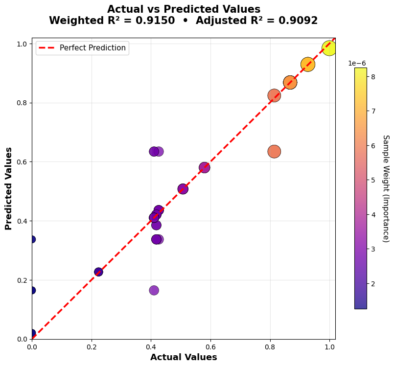
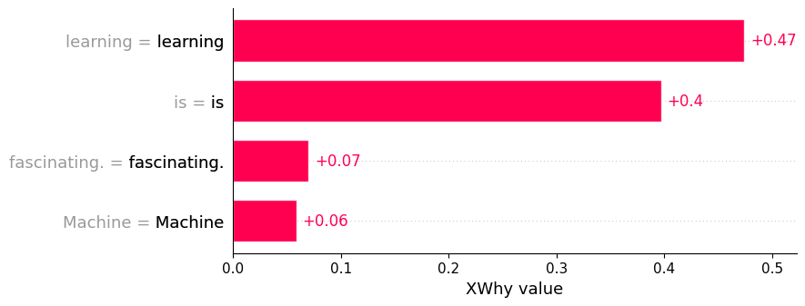
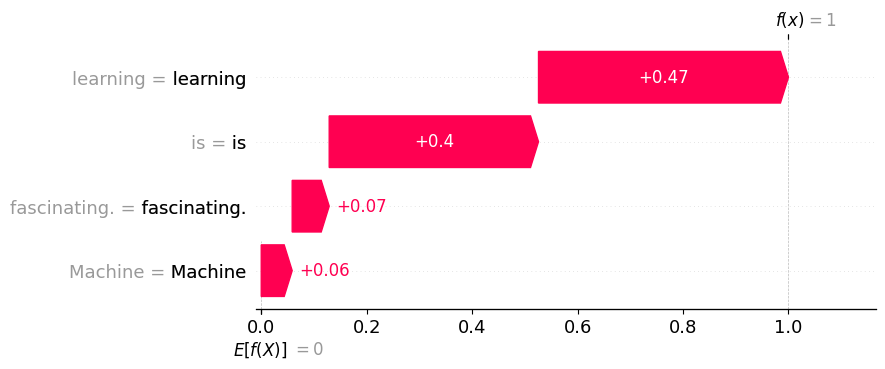
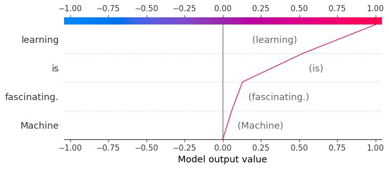
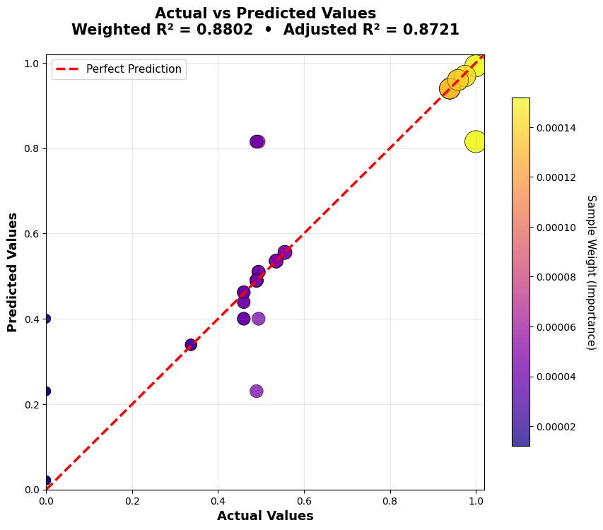
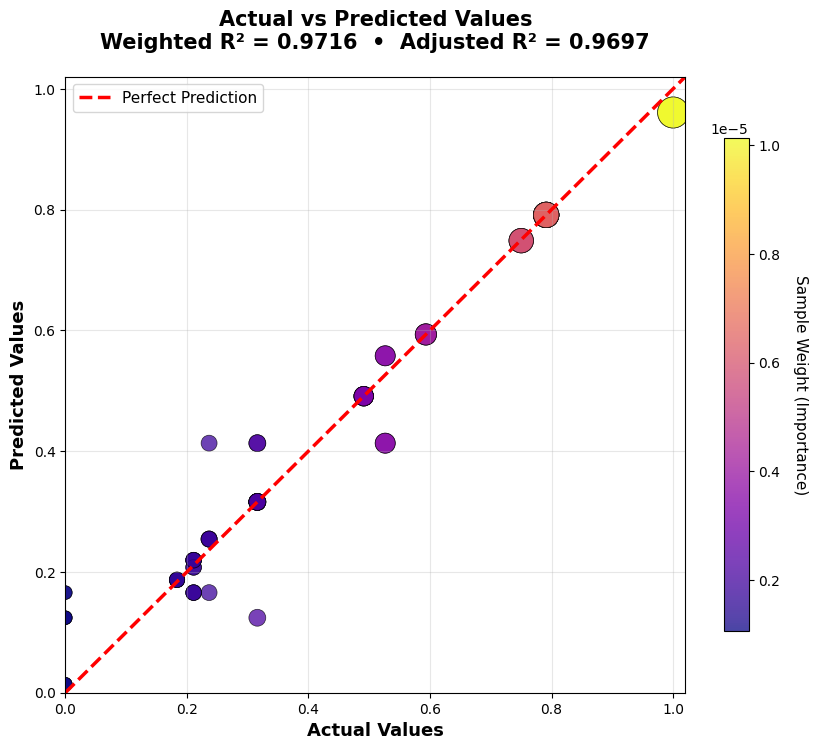
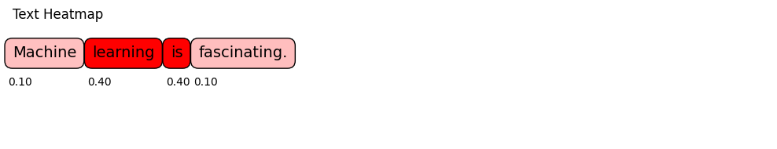
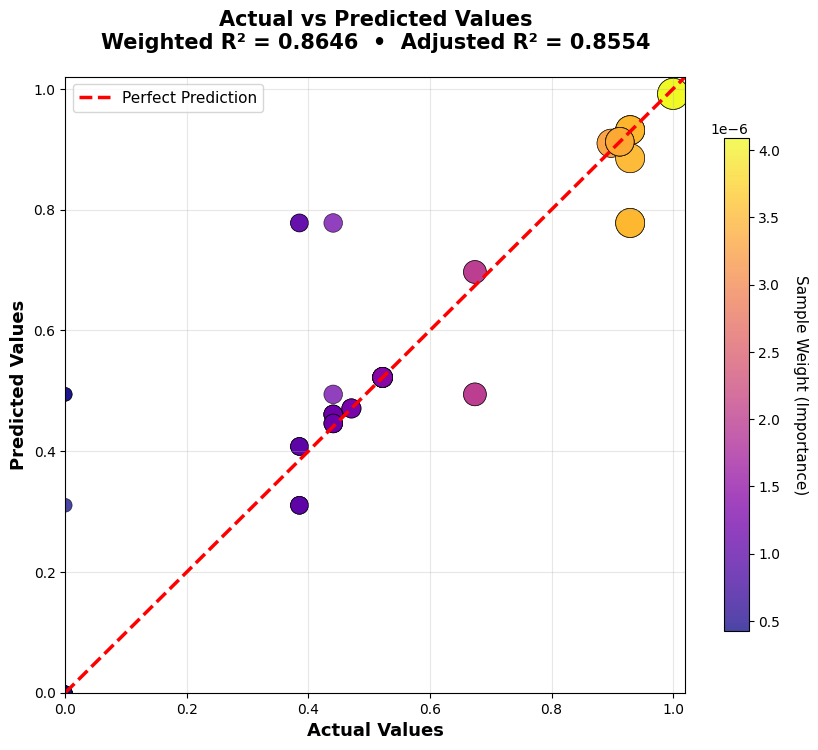
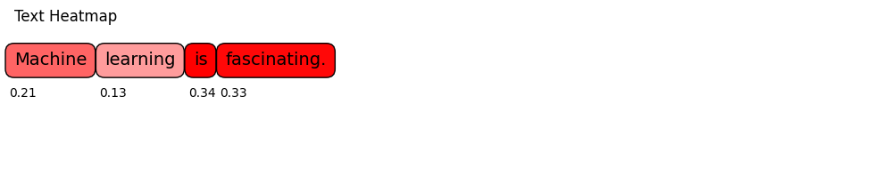

# Example Walkthrough: LLM Explainer in Action

This page walks through a real run of XWhy's `LLMExplainer` on a single sentence,
comparing four word-embedding backends and showing exactly what each plot means.
Every code snippet, metric, and image below comes directly from an executed notebook run.

---

## Setup

Install XWhy and, optionally, turn on XWhy's logger to watch the pipeline progress
(perturbation generation, embedding loading, surrogate model selection) in real time:

```python
import logging
import sys
import xwhy
from xwhy import LLMExplainer

xwhy_logger = logging.getLogger("xwhy")
xwhy_logger.setLevel(logging.INFO)

handler = logging.StreamHandler(sys.stdout)
formatter = logging.Formatter("%(asctime)s | %(levelname)s | %(name)s | %(message)s")
handler.setFormatter(formatter)
xwhy_logger.addHandler(handler)
```

The example instance explained throughout this page is the sentence:

> *"Machine learning is fascinating."*

---

## Case 1: Google News (word2vec) Embedding

<div class="xwhy-example" markdown>
<div class="xwhy-example__header"><span>Run the explainer</span><span>xwhy.LLMExplainer</span></div>
<div class="xwhy-example__body" markdown>

```python
explainer = LLMExplainer(provider="openai", use_best_surrogate=True, api_key=api_key)
result = explainer.explain(instance="Machine learning is fascinating.", model_name="gpt-5-nano")

print(result.metrics)
xwhy.plots.text_heatmap(result)
result.plot()
```

Behind the scenes, XWhy queries the model, generates perturbations of the input
sentence, embeds them with the `GoogleNews-vectors-negative300` word2vec model,
computes Word Mover's Distance (WMD) similarities, and searches for the
best-fitting surrogate model:

<div class="xwhy-example__output" markdown>
```
Optimization complete. Selected surrogate model: 'randomforest' (Best Score: 0.9150)

--------------------------------------------------------------------------------
Fidelity Metrics:
  Mean Squared Error (MSE)            0.0061
  Mean Absolute Error (MAE)           0.0334
  Weighted R-squared (R²ω)            0.9150
  Weighted Adjusted R-squared (R^²ω)  0.9092
--------------------------------------------------------------------------------
```
</div>

The **weighted R²** tells you how faithfully the local surrogate model reproduces
the LLM's original behavior around this instance — closer to 1.0 means the
explanation can be trusted more.

</div>
</div>

<div class="xwhy-example" markdown>
<div class="xwhy-example__header"><span>Text heatmap</span><span>xwhy.plots.text_heatmap(result)</span></div>
<div class="xwhy-example__body" markdown>

Darker red means the word contributed more to the model's output.

<div class="xwhy-example__output" markdown>

</div>

`learning` (0.47) and `is` (0.40) dominate the response, while `Machine` and
`fascinating.` contribute comparatively little.

</div>
</div>

<div class="xwhy-example" markdown>
<div class="xwhy-example__header"><span>Fidelity plot</span><span>result.plot()</span></div>
<div class="xwhy-example__body" markdown>

Each point is a perturbed sample; the closer it sits to the red dashed line,
the better the surrogate model's prediction matches the real model's output
for that sample. Point size/color encode the sample's importance weight.

<div class="xwhy-example__output" markdown>

</div>

</div>
</div>

<div class="xwhy-example" markdown>
<div class="xwhy-example__header"><span>Bar plot</span><span>xwhy.plots.bar(result)</span></div>
<div class="xwhy-example__body" markdown>

A ranked view of the same per-word contributions.

<div class="xwhy-example__output" markdown>

</div>

</div>
</div>

<div class="xwhy-example" markdown>
<div class="xwhy-example__header"><span>Waterfall plot</span><span>xwhy.plots.waterfall(result)</span></div>
<div class="xwhy-example__body" markdown>

Shows how each word pushes the output from the base expectation `E[f(X)] = 0`
up to the final prediction `f(x) = 1`, one word at a time.

<div class="xwhy-example__output" markdown>

</div>

</div>
</div>

<div class="xwhy-example" markdown>
<div class="xwhy-example__header"><span>Decision plot</span><span>xwhy.plots.decision(result)</span></div>
<div class="xwhy-example__body" markdown>

Traces the cumulative effect of each feature as a single path from left to right.

<div class="xwhy-example__output" markdown>

</div>

</div>
</div>

---

## Comparing Embedding Backends

The same sentence and model were re-explained using three other embeddings,
each swapping only the `embedding_type` argument:

```python
explainer = LLMExplainer(provider="openai", use_best_surrogate=True, api_key=api_key)
result = explainer.explain(
    instance="Machine learning is fascinating.",
    model_name="gpt-5-nano",
    embedding_type="glove",       # or "paragram_sl" / "paragram_ws"
    fidelity_plot=True,
)
```

!!! tip
    Pass `fidelity_plot=True` the first time you try a new embedding backend, so
    you can sanity-check the surrogate fit before trusting the explanation it
    produces.

| Case | Embedding | Weighted R² | Adjusted R² | MAE |
| --- | --- | --- | --- | --- |
| 1 | word2vec (GoogleNews) | 0.9150 | 0.9092 | 0.0334 |
| 2 | GloVe | 0.8802 | 0.8721 | 0.0362 |
| 3 | Paragram-SL | **0.9716** | **0.9697** | **0.0219** |
| 4 | Paragram-WS | 0.8646 | 0.8554 | 0.0436 |

Paragram-SL produced the best-fitting surrogate for this sentence, and its
word-importance heatmap agrees closely with word2vec's. Paragram-WS tells a
noticeably different story — worth keeping in mind when picking an embedding
for your own explanations.

<div class="xwhy-example" markdown>
<div class="xwhy-example__header"><span>GloVe</span><span>embedding_type="glove"</span></div>
<div class="xwhy-example__body" markdown>
<div class="xwhy-example__output" markdown>


</div>
</div>
</div>

<div class="xwhy-example" markdown>
<div class="xwhy-example__header"><span>Paragram-SL</span><span>embedding_type="paragram_sl"</span></div>
<div class="xwhy-example__body" markdown>
<div class="xwhy-example__output" markdown>


</div>
</div>
</div>

<div class="xwhy-example" markdown>
<div class="xwhy-example__header"><span>Paragram-WS</span><span>embedding_type="paragram_ws"</span></div>
<div class="xwhy-example__body" markdown>
<div class="xwhy-example__output" markdown>


</div>

Notice how Paragram-WS spreads importance much more evenly across all four
words (0.21 / 0.13 / 0.34 / 0.33) instead of concentrating it on `learning`
and `is` like the other three embeddings.

</div>
</div>

---

## Graceful Handling of Filtered Provider Responses

Not every prompt gets a usable response back from a provider — safety filters
or provider-side anomalies can return an empty completion. XWhy surfaces this
as a clear, catchable error instead of crashing the pipeline:

<div class="xwhy-example" markdown>
<div class="xwhy-example__header"><span>Filtered response</span><span>try / except</span></div>
<div class="xwhy-example__body" markdown>

```python
try:
    explainer = LLMExplainer(provider="openai", use_best_surrogate=True, api_key=api_key)
    result = explainer.explain(instance="...", model_name="gpt-5-nano", embedding_type="paragram_ws")
    print(result.metrics)
except Exception as e:
    print(f"Error during pipeline execution: {e}")
```

<div class="xwhy-example__output" markdown>
```
Error during pipeline execution: Received an empty response from the OpenAI API.
This could be due to safety guardrails, network filtering (anti-filter), or
provider-side anomalies.
```
</div>

This came up twice in testing (once for a time-travel/physics question, once
for a first-aid question) — both unrelated to XWhy's own logic, and both
handled the same predictable way.

</div>
</div>

---

## Takeaways

* **Fidelity varies by embedding.** For this sentence, Paragram-SL gave the
  most trustworthy local surrogate (R² = 0.97); GloVe and Paragram-WS trailed
  noticeably behind word2vec.
* **Word importance isn't embedding-invariant.** Three of the four embeddings
  agreed that `learning` and `is` mattered most — Paragram-WS disagreed
  substantially. If an explanation looks surprising, try a second embedding
  before trusting it.
* **Errors are explicit.** When a provider returns nothing usable, XWhy raises
  a descriptive exception rather than failing silently or crashing.

Next step: see the [LLM Explainer Guide](llm_explainer.md) for the full API reference.
