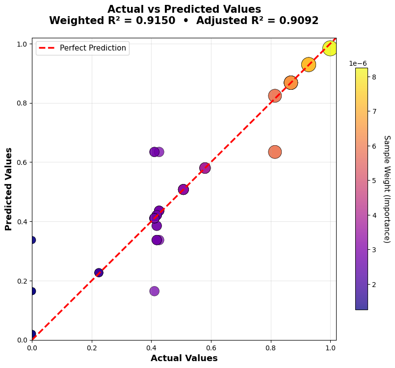
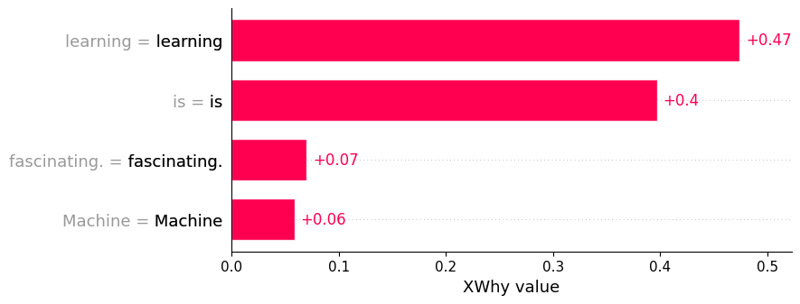
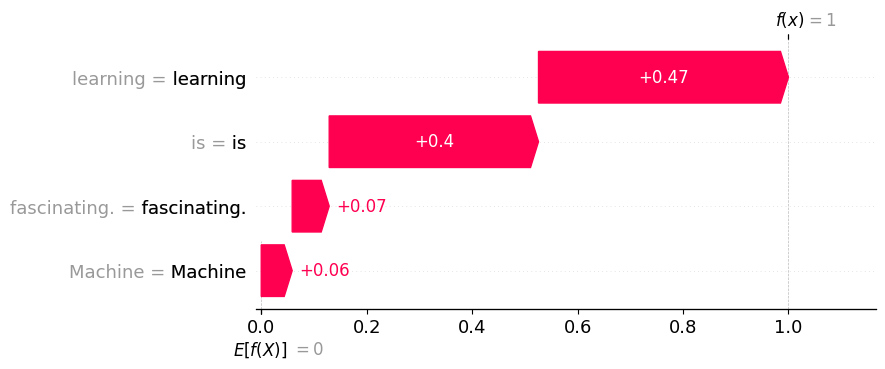
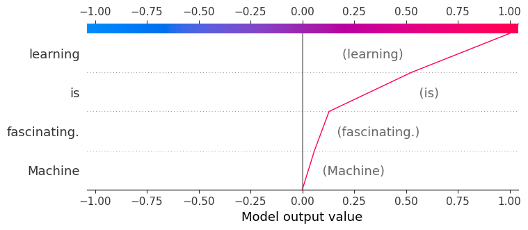
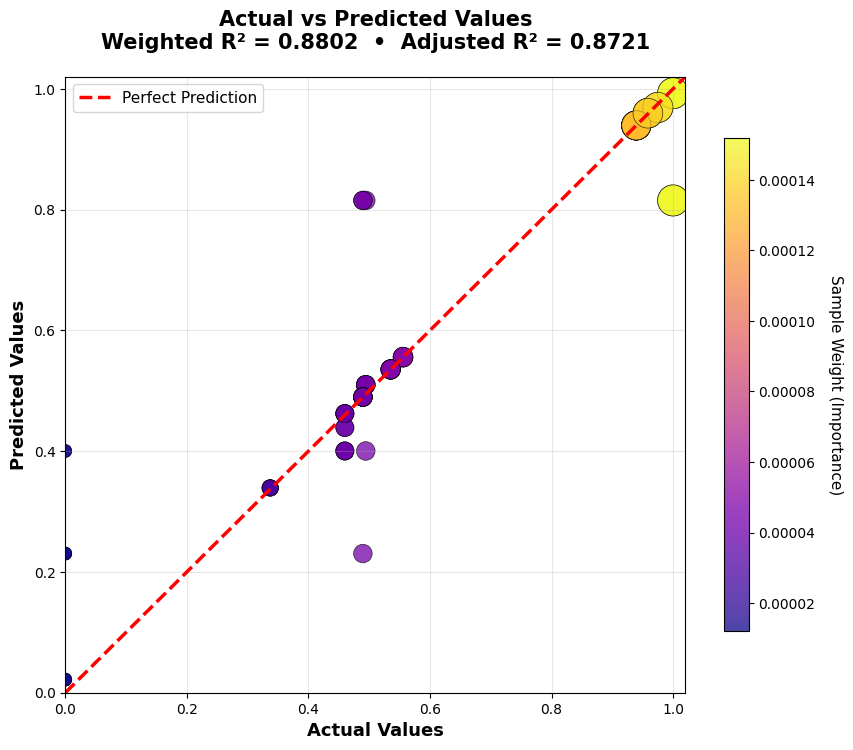
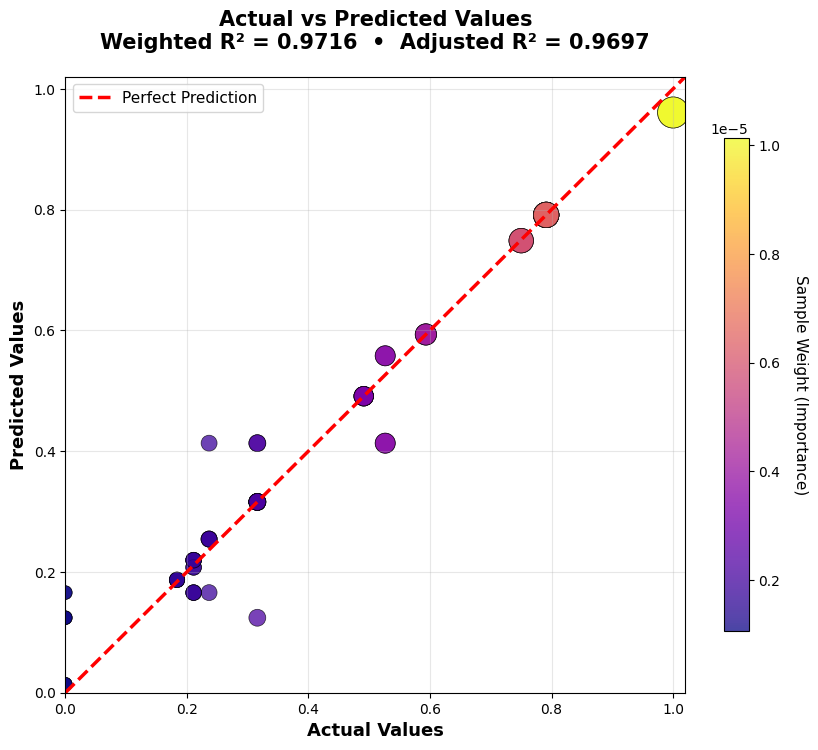
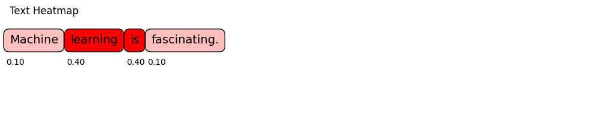
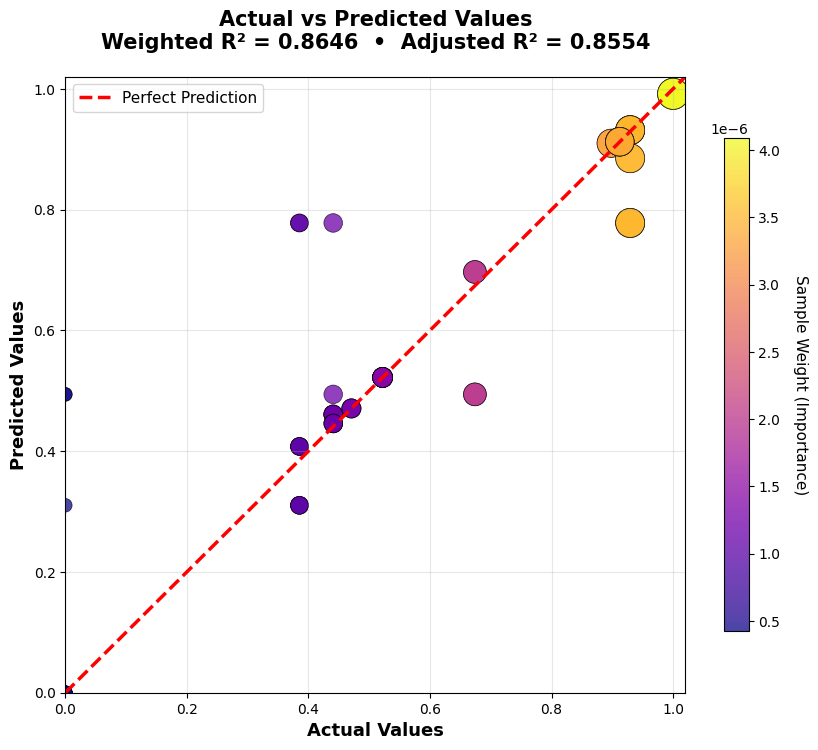
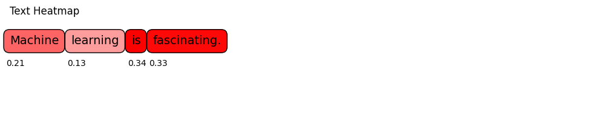

# LLM Example

Large language model outputs depend on interacting words, tokens, and context. XWhy treats the model as a black box: it obtains the original response, perturbs the input prompt, measures the semantic distance between that response and each perturbed prompt, and fits a local surrogate model that estimates how the prompt terms contribute to this response-alignment score.

This example covers setup, execution, interpretation, and an executed comparison of four embedding backends. It does not expose private chain-of-thought or reconstruct the model's internal computation.

## Prerequisites

Before starting:

1. [Install XWhy](getting-started/installation.md).
2. Obtain access to a supported LLM provider and model.
3. Configure the provider credential without committing it to source control.

For OpenAI, the standard `.env` configuration is:

```env
OPENAI_API_KEY=your_openai_api_key_here
```

For other providers, local models, cloud platforms, or notebook-specific credential patterns, use the [provider configuration guide](how-to/providers.md). Provider-specific constructor arguments must use the names expected by the provider SDK; for example, OpenAI uses `api_key`, while Hugging Face uses `token`.

## 1. Generate a local explanation

The following example explains one prompt with an OpenAI model and the default Word2Vec embedding backend:

```python
import xwhy
from xwhy import LLMExplainer

# Required for interactive JavaScript plots in notebook environments.
xwhy.plots.initjs()

explainer = LLMExplainer(
    provider="openai",
    model_name="gpt-5-nano",
    embedding_type="word2vec",
    use_best_surrogate=True,
)

result = explainer.explain(
    instance="Machine learning is fascinating.",
    fidelity_plot=True,
)

print(result.metrics)
xwhy.plots.text_heatmap(result)
result.plot()
```

Replace `model_name` with a model available through your provider account.

!!! tip "Notebook credentials"
    In a notebook, you may pass a credential directly to the constructor, such as `api_key=...`, but obtain it from a secret store or a hidden prompt rather than writing it into the notebook.

## 2. Understand the explanation pipeline

For the selected prompt, XWhy:

1. obtains the original model response;
2. generates perturbed versions of the input prompt;
3. computes Word Mover's Distance between the original response and each perturbed prompt;
4. normalises those distances into the local target scores;
5. fits a surrogate model to the perturbation masks and target scores; and
6. returns term contributions, evaluation metrics, and diagnostic plots.

The current implementation queries the LLM for the original response only; it does not generate a new LLM response for every perturbed prompt. The result is therefore an explanation of the local prompt-to-response alignment constructed by this pipeline, not a global description of the model.

## 3. Read the result

The token heatmap and contribution plots show the estimated direction and magnitude of each term's contribution to the local response-alignment score. The metrics describe how well the surrogate approximates the sampled score surface near the original prompt.

Important metrics include:

- **Weighted R²:** proportion of locally weighted variation represented by the surrogate; values closer to 1 indicate a closer fit on the sampled neighbourhood.
- **Adjusted weighted R²:** weighted R² with a penalty for model complexity.
- **MAE and MSE:** average surrogate prediction errors; lower values indicate a closer numerical fit.

A strong fidelity score supports the use of the surrogate for that run, but it does not prove that the attribution is causal or universally stable.

## 4. Worked example: Word2Vec

The following results come from an executed run using the sentence:

> *Machine learning is fascinating.*

The automatic surrogate search selected a random forest with these fidelity metrics:

| Metric | Value |
| --- | ---: |
| Weighted R² | 0.9150 |
| Adjusted weighted R² | 0.9092 |
| Mean absolute error | 0.0334 |
| Mean squared error | 0.0061 |

### Term attribution


In this run, `learning` and `is` received the largest contribution estimates. This is evidence about one local response-alignment approximation, not a general linguistic or causal claim about those words.

### Surrogate fidelity



Each point represents a perturbed prompt. Points closer to the reference line indicate closer agreement between the surrogate prediction and the response-alignment score calculated by the XWhy pipeline.

### Alternative contribution views

The same explanation can be inspected using ranked, cumulative, or path-based views:

```python
xwhy.plots.bar(result)
xwhy.plots.waterfall(result)
xwhy.plots.text(result)
xwhy.plots.force(result)
xwhy.plots.decision(result)
```







These plots present the same local contribution estimates in different forms; they are not independent explanations.

## 5. Compare embedding backends

Embedding choice affects how XWhy measures semantic distance between the original response and the perturbed prompt variants. To compare backends fairly, keep the prompt, provider, model, seed, perturbation count, and surrogate-selection setting fixed, and change only `embedding_type`:

```python
from xwhy import LLMExplainer

embedding_types = ["word2vec", "glove", "paragram_sl", "paragram_ws"]
results = {}

for embedding_type in embedding_types:
    explainer = LLMExplainer(
        provider="openai",
        model_name="gpt-5-nano",
        embedding_type=embedding_type,
        seed=1024,
        num_perturbations=64,
        use_best_surrogate=True,
    )
    results[embedding_type] = explainer.explain(
        instance="Machine learning is fascinating.",
        fidelity_plot=True,
    )
```

The executed comparison produced:

| Embedding | Weighted R² | Adjusted weighted R² | MAE |
| --- | ---: | ---: | ---: |
| Word2Vec (Google News) | 0.9150 | 0.9092 | 0.0334 |
| GloVe | 0.8802 | 0.8721 | 0.0362 |
| Paragram-SL | **0.9716** | **0.9697** | **0.0219** |
| Paragram-WS | 0.8646 | 0.8554 | 0.0436 |

Paragram-SL had the closest surrogate fit in this particular run. This table is not a general ranking: performance can change with the prompt, generated response, embedding, perturbations, and random seed.

### GloVe




### Paragram-SL





### Paragram-WS





Word2Vec, GloVe, and Paragram-SL produced broadly similar emphasis for this sentence, while Paragram-WS distributed importance more evenly. When an attribution is sensitive to the embedding backend, report that sensitivity rather than selecting only the most convenient result.

## 6. Use a reproducible configuration object

For experiments, place the explanation settings in an `LLMConfig` object:

```python
from xwhy import LLMExplainer
from xwhy.core import LLMConfig

config = LLMConfig(
    provider_type="openai",
    model_name="gpt-5-nano",
    max_tokens=200,
    temperature=0,
    seed=1024,
    num_perturbations=64,
    embedding_type="word2vec",
    surrogate_type="lime",
    use_best_surrogate=True,
)

explainer = LLMExplainer(config=config)
result = explainer.explain(
    instance="Machine learning is fascinating.",
    fidelity_plot=True,
)
```

Record the provider, model identifier, embedding, surrogate policy, perturbation count, seed, package version, and date of execution. See [Reproducible Explanations](how-to/reproducibility.md) for a fuller checklist.

## 7. Handle provider and setup errors

Use explicit error handling around provider calls:

```python
try:
    result = explainer.explain(
        instance="Machine learning is fascinating.",
        fidelity_plot=True,
    )
except Exception as error:
    print(f"The explanation could not be generated: {error}")
```

Common causes include:

- a missing or incorrectly named credential;
- a model that is unavailable to the provider account;
- an empty or filtered provider response;
- a network or provider-side failure; and
- an embedding cache directory that is unavailable or not writable.

XWhy raises an explicit error when a provider returns no usable response, allowing the application to log, retry, or safely stop the explanation workflow.

For pipeline diagnostics, use the [logging guide](how-to/logging.md).

## Interpretation and reporting guidance

When reporting an LLM explanation:

- describe it as a **local perturbation-based response-alignment approximation**;
- include surrogate fidelity metrics;
- state the embedding backend and sampling configuration;
- test whether the main attribution pattern changes across reasonable settings; and
- avoid presenting term contributions as hidden reasoning, causal proof, or a complete safety assessment.

The [LLM explainer overview](explainers/llm/index.md) summarises the capability, and the [API reference](reference/xwhy/explainers/llm.md) provides the implementation interface.
