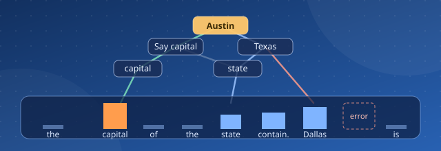

[← All research and insights](../blogs.md){ .xwhy-blog-back }

# From circuit tracing to input-token importance



*LLM interpretability · XWhy explainer · Circuit tracing, attribution graphs and token attribution*

!!! abstract "In short"
    **Input-token importance is the projection of a circuit-tracing attribution graph onto the prompt.** Start from the target output node, follow every weighted path backwards until it reaches an input embedding, add up the influence that arrives at each token, keep the unexplained *error* share separate, and normalise. The result is a token heatmap that is directly comparable with SMILE, SHAP, LIME or Integrated Gradients, but it inherits the mechanistic grounding of the graph.

Ask a language model to complete *"Fact: the capital of the state containing Dallas is"* and it answers **Austin**. Nowhere in the prompt does the word *Texas* appear. Somewhere inside the model, *Dallas* had to become *Texas*, and *Texas* combined with *capital* had to become *Austin*.

In 2025, Anthropic's interpretability team made that hidden hop visible. Their papers [*Circuit Tracing: Revealing Computational Graphs in Language Models*](https://transformer-circuits.pub/2025/attribution-graphs/methods.html) and [*On the Biology of a Large Language Model*](https://transformer-circuits.pub/2025/attribution-graphs/biology.html) introduced **attribution graphs**, which are maps of the interpretable features a model uses on one prompt and of how those features push on each other. The Dallas example became one of the best-known pictures in interpretability, retold in Anthropic's accessible essay [*Tracing the thoughts of a large language model*](https://www.anthropic.com/research/tracing-thoughts-language-model). The tooling was later released as the open-source [**circuit-tracer**](https://github.com/safety-research/circuit-tracer) library, with an interactive graph explorer on [Neuronpedia](https://www.neuronpedia.org/gemma-2-2b/graph) ([announcement](https://www.anthropic.com/research/open-source-circuit-tracing)).

Most people who use explainability in practice ask a simpler question, though: **which words in my prompt mattered?** This is input-token explainability, the question answered by tools such as XWhy's [LLM explainer](../../../explainers/llm/index.md), [SHAP](https://arxiv.org/abs/1705.07874), [LIME](https://arxiv.org/abs/1602.04938) and [Integrated Gradients](https://arxiv.org/abs/1703.01365). This article explains how the two views connect. It shows how to read an attribution graph and turn it into a ranked list of input tokens in five steps. It also explains when you should prefer one view over the other.

## Two questions, two kinds of answer

| | Circuit tracing (attribution graph) | Input-token explainability |
| --- | --- | --- |
| **Question** | *How* did the model compute the answer? | *Which* input tokens drove the answer? |
| **Output** | A graph of features, intermediate concepts and weighted edges | One score per prompt token |
| **Access needed** | White-box: weights, activations and trained [transcoders](https://arxiv.org/abs/2406.11944) | Black-box (SMILE, LIME, SHAP) or gradients (Integrated Gradients) |
| **Strength** | Reveals multi-step reasoning, such as Dallas → Texas → Austin | Compact, comparable and easy to evaluate and report |
| **Weakness** | Large, model-specific and time-consuming to read | Hides *why* a token matters and which route it took |

Neither view replaces the other. A token heatmap can tell you that *Dallas* mattered, but not that it mattered *because the model internally retrieved Texas*. A graph shows the route, but with hundreds of nodes it is hard to compare across prompts, models or explainers. **Collapsing the graph onto the input tokens provides a mechanistically grounded token score, and that score can be checked against perturbation-based explainers.**

## Step 1: Decide what you want from the graph

<figure markdown>
  ![Step 1 diagram titled "What exactly do we want from this figure?". It shows an intervention graph for the prompt "Fact: the capital of the state containing Dallas is". Purple input-representation nodes (Emb: capital, Emb: state, Emb: Dallas) feed blue internal-concept nodes (capital, state, Say a capital, Texas), which lead to the green target node Say Austin. Nearby are Say Victoria and a British Columbia node, with intervention labels 2x and minus 2x and activation percentages (100%, 102%, 25%, 0%). A callout explains that these interventions are not token importance. The example top outputs are: the 8%, Albany 6%, not 6%, Harrisburg 5% and Hartford 4%. The banner reads: "Our goal is to understand how much each input token contributed to predicting Austin."](../../../assets/images/blogs/circuit-tracing/step-1-intervention-graph.webp){ loading=lazy width="1672" height="941" }
  <figcaption>Step 1: read the intervention graph. Purple nodes are input embeddings, blue nodes are internal concepts and the green node is the target, <em>Say Austin</em>. The 2× / −2× labels are interventions, not importance. The goal is to measure how much each prompt token contributed to predicting <em>Austin</em>.</figcaption>
</figure>

The figure is an **intervention graph** for the Dallas prompt. Read it from the bottom up:

- **Input representation nodes** (`Emb: capital`, `Emb: state`, `Emb: Dallas`) are the token embeddings. Every piece of information the model uses begins here.
- **Internal model concepts**, such as *capital*, *state*, *Texas* and *Say a capital*, are interpretable features found by the replacement model's transcoders.
- **The target concept**, *Say Austin*, is the feature cluster that pushes the logit for **Austin**.

The labels **2×** and **−2×** and the percentages are *interventions*. In the original experiment, the researchers suppressed the *Texas* features and injected *British Columbia* features, and the model's answer moved from Austin to **Victoria**. These experiments show that the circuit is causal, but **they are not token importance**. Keep them aside for validation. The quantity you want is a number for each prompt token that says how much it contributed to *Austin*.

## Step 2: Find where the inputs enter the graph

<figure markdown>
  ![Step 2 diagram titled "Where do the inputs enter the graph?". A dashed blue box at the bottom groups the source nodes Emb: capital, Emb: state and Emb: Dallas. Upward arrows connect them to a dashed orange box of target-side reasoning nodes (capital, state, Say a capital, Texas, Say Austin), which leads to Say Victoria and British Columbia. A colour guide shows blue as input or source nodes, grey as intermediate nodes and yellow as the target output. A callout reads: "To obtain Input Token Importance, we must eventually trace the contribution back to the input embeddings."](../../../assets/images/blogs/circuit-tracing/step-2-source-nodes.webp){ loading=lazy width="1672" height="941" }
  <figcaption>Step 2: find the source nodes. Every contribution to the answer enters the graph through an embedding node, so token importance must be traced all the way back to <code>Emb: capital</code>, <code>Emb: state</code> and <code>Emb: Dallas</code>, not just to the reasoning nodes near the target.</figcaption>
</figure>

In an attribution graph, information flows from sources to the target. The **source nodes** are the embedding nodes, one for each prompt position. The reasoning nodes near the target sit in the middle. They are the most interesting part of the circuit, but they are not the inputs.

This matters for the conversion. The graph shows direct edges such as `capital → Say a capital`, but a token score must include **all indirect influence** that starts at a token's embedding and eventually arrives at the output. Looking at the top of the graph alone would miss that influence.

In the `circuit-tracer` implementation, the adjacency matrix stores nodes in a fixed order: `[active features, error nodes, embedding nodes, logit nodes]`. Rows are targets and columns are sources. The embedding block therefore contains one column for each input token, which gives you the token axis directly.

## Step 3: Trace every path back from the target

<figure markdown>
  ![Step 3 diagram titled "Trace the paths back from Austin". Three colour-coded paths lead back from the Say Austin node to the inputs. The green path for capital runs Emb: capital, capital, Say a capital, Say Austin. The blue path for state runs Emb: state, state, Texas, Say Austin. The red path for Dallas runs Emb: Dallas, Texas, Say Austin. Say Victoria and British Columbia are faded. The banner reads: "Token Importance is not obtained from a single edge or a single number in the figure; it is obtained from the sum of all traced paths back to the inputs."](../../../assets/images/blogs/circuit-tracing/step-3-trace-paths.webp){ loading=lazy width="1672" height="941" }
  <figcaption>Step 3: trace every path from the target back to the inputs. <em>capital</em> works through <em>Say a capital</em>, while <em>state</em> and <em>Dallas</em> both work through <em>Texas</em>. A token's importance is the sum over all of its paths, not any single edge.</figcaption>
</figure>

To score a token, consider **every path** from the target node (*Say Austin*) back to that token's embedding:

- **capital**: `Emb: capital → capital → Say a capital → Say Austin`
- **state**: `Emb: state → state → Texas → Say Austin`
- **Dallas**: `Emb: Dallas → Texas → Say Austin`

The influence along one path is the product of its normalised edge weights. The influence of a token is the **sum over all of its paths**. The token score is therefore not one edge or one number read from the figure. It is the combined result of every traced route.

In matrix form, let **A** be the adjacency matrix with each row normalised by the absolute values of its incoming weights. Paths of length *k* are captured by **A**<sup>*k*</sup>, so the total influence over paths of every length is:

<p class="xwhy-formula" role="math" aria-label="B equals A plus A squared plus A cubed and so on, which equals the inverse of I minus A, minus I"><var>B</var> = <var>A</var> + <var>A</var><sup>2</sup> + <var>A</var><sup>3</sup> + … = (<var>I</var> − <var>A</var>)<sup>−1</sup> − <var>I</var></p>

This is the same *indirect influence* computation that Anthropic uses to [prune attribution graphs](https://transformer-circuits.pub/2025/attribution-graphs/methods.html). It appears as `compute_influence` in [circuit-tracer's `graph.py`](https://github.com/safety-research/circuit-tracer/blob/main/circuit_tracer/graph.py).

## Step 4: Add up each input's contribution, and keep the error separate

<figure markdown>
  ![Step 4 diagram titled "Sum the contribution of each input". The graph and interventions are faded in the background. Dashed contribution paths in blue, orange and green converge on three summation nodes below Emb: capital, Emb: state and Emb: Dallas, labelled "Sum of contributions for capital", "for state" and "for Dallas". A side panel gives the formula: I sub i is proportional to the sum of contributions from the paths ending at token i. A red Error share panel reads: "We keep the unexplained part separate and do not assign it to the tokens." The banner says that for each input embedding we add all contributions from the paths that reach it to obtain its final share in the prediction.](../../../assets/images/blogs/circuit-tracing/step-4-sum-contributions.webp){ loading=lazy width="1672" height="941" }
  <figcaption>Step 4: add up everything that reaches each embedding. Each token gets the sum of the contributions from all paths ending at it. The part the replacement model cannot explain is kept as a separate <strong>error share</strong> and is not assigned to any token.</figcaption>
</figure>

Weight the output logits by their probabilities, propagate that weight through **B** and read off the embedding columns. This gives the raw importance of each token:

<p class="xwhy-formula" role="math" aria-label="I sub i is proportional to the sum, over all paths from the embedding of token i to the target, of the product of normalised edge weights along each path"><var>I<sub>i</sub></var> ∝ <span class="xwhy-formula__op">Σ</span><sub>paths Emb<sub><var>i</var></sub> → target</sub> <span class="xwhy-formula__op">Π</span><sub>edges on path</sub> <var>Ã</var><sub>edge</sub></p>

The **error share** is where this method differs from most token heatmaps. Circuit tracing replaces the model's MLPs with transcoders, and the replacement is imperfect. The part it cannot reconstruct is represented by **error nodes**. Some of the output's influence flows through those error nodes, and that influence cannot be honestly assigned to any token. A faithful conversion therefore **reports the error share as a separate bucket** and does not spread it across the tokens. Gradient and perturbation methods have no equivalent of this *explicit, measured uncertainty*.

## Step 5: Normalise to get input-token importance

<figure markdown>
  ![Step 5 bar chart titled "Normalization and Construction of Input Token Importance", showing the relative importance of each input token: the 0.032, capital 0.271 (highlighted in orange as the largest), of 0.024, the 0.028, state 0.118, containing 0.137, Dallas 0.181 and is 0.021. The captions read: "After summing the contributions, we normalize them to obtain the relative importance of each token" and "Thus, Input Token Importance is the projection of the model's internal graph onto the input tokens."](../../../assets/images/blogs/circuit-tracing/step-5-token-importance.webp){ loading=lazy width="1672" height="941" }
  <figcaption>Step 5: normalise to get input-token importance. <em>capital</em> (0.271), <em>Dallas</em> (0.181), <em>containing</em> (0.137) and <em>state</em> (0.118) carry most of the weight, and function words stay near zero. The bars sum to 0.812, and the remainder is the error share.</figcaption>
</figure>

Finally, divide by the total influence that reaches the inputs, *including the error nodes*:

<p class="xwhy-formula" role="math" aria-label="Normalised importance of token i equals I sub i divided by the sum of all token influences plus the error influence. The error share equals the error influence divided by the same total."><var>Î<sub>i</sub></var> = <var>I<sub>i</sub></var> / (Σ<sub><var>j</var></sub> <var>I<sub>j</sub></var> + <var>I</var><sub>error</sub>)<span class="xwhy-formula__gap"></span>error share = <var>I</var><sub>error</sub> / (Σ<sub><var>j</var></sub> <var>I<sub>j</sub></var> + <var>I</var><sub>error</sub>)</p>

In the illustrative example, the token scores add up to **0.812**, so about **19%** of the influence remains unexplained. That leftover is the error share, and you should report it alongside the heatmap. The ranking follows the circuit:

1. **capital (0.271)** selects the *Say a capital* pathway. Without it, the model has no reason to produce a city.
2. **Dallas (0.181)** is the only source of *Texas*, which the model has to work out for itself.
3. **containing (0.137)** and **state (0.118)** define the relation *"the state that contains X"*.
4. Function words such as *the*, *of* and *is* receive little weight.

The ratio Σ<sub>*i*</sub> *I*<sub>*i*</sub> / (Σ<sub>*i*</sub> *I*<sub>*i*</sub> + *I*<sub>error</sub>) is exactly what circuit-tracer calls the graph's **replacement score**. The token importance vector is therefore the per-token breakdown of a quality metric the library already computes.

## Try it with circuit-tracer

The sketch below uses the public [circuit-tracer](https://github.com/safety-research/circuit-tracer) API with Gemma-2-2B and its released transcoders. Node ordering follows the library's `Graph` class.

```python
import torch
from circuit_tracer import ReplacementModel, attribute
from circuit_tracer.graph import normalize_matrix, compute_influence

model = ReplacementModel.from_pretrained("google/gemma-2-2b", "gemma", dtype=torch.bfloat16)
prompt = "Fact: the capital of the state containing Dallas is"
graph = attribute(prompt=prompt, model=model, max_n_logits=10, desired_logit_prob=0.95)

n_tokens = len(graph.input_tokens)
n_logits = len(graph.logit_targets)
n_features = len(graph.selected_features)
error_start, error_end = n_features, n_features + n_tokens * graph.cfg.n_layers
token_end = error_end + n_tokens

# Weight each output logit by its probability, then propagate through all paths.
logit_weights = torch.zeros(graph.adjacency_matrix.shape[0])
logit_weights[-n_logits:] = graph.logit_probabilities
influence = compute_influence(normalize_matrix(graph.adjacency_matrix), logit_weights)

token_influence = influence[error_end:token_end]            # one value per input token
error_influence = influence[error_start:error_end].sum()    # kept separate
total = token_influence.sum() + error_influence

importance = (token_influence / total).tolist()
tokens = [model.tokenizer.decode(t) for t in graph.input_tokens]
for tok, score in zip(tokens, importance):
    print(f"{tok!r:>14}  {score:.3f}")
print(f"{'error share':>14}  {(error_influence / total).item():.3f}")
```

To attribute a single answer, such as *Austin* on its own instead of the top-*k* logit mix, pass that token through `attribution_targets` and keep only its logit weight. Before you rely on the numbers, open [the Dallas → Austin graph on Neuronpedia](https://www.neuronpedia.org/gemma-2-2b/graph?slug=gemma-fact-dallas-austin) and check the paths yourself.

## How does this compare with other token-attribution methods?

| Method | What it measures | Access | Handles multi-hop reasoning? | Reports what is unexplained? |
| --- | --- | --- | --- | --- |
| **Circuit-traced token importance** | Path-summed influence through interpretable features | White-box + transcoders | Yes, explicitly (via *Texas*) | Yes (error share) |
| [**SMILE / gSMILE**](https://arxiv.org/abs/2505.21657) (XWhy) | Local surrogate fitted to output changes under prompt perturbations | Black-box, works with API models | Implicitly | Via surrogate fit (R², fidelity) |
| [**LIME**](https://arxiv.org/abs/1602.04938) / [**SHAP**](https://arxiv.org/abs/1705.07874) | Local surrogate or Shapley value of token presence | Black-box | Implicitly | Partially (fit / additivity) |
| [**Integrated Gradients**](https://arxiv.org/abs/1703.01365) | Path integral of gradients from a baseline | Gradients | No | Completeness axiom only |
| [**Attention rollout**](https://arxiv.org/abs/2005.00928) | Propagated attention weights | Attention maps | No, and attention is not the whole computation | No |

The main distinction is that perturbation methods such as **SMILE observe what happens** when a token is removed, whereas circuit tracing **reads how the model computes** with it. When both methods rank *capital* and *Dallas* first, you have two independent lines of evidence. When they disagree, you have found something worth investigating. Possible causes include a high error share, redundant pathways that hide a token's effect when it is removed, or a perturbation scheme that creates unnatural prompts. For concrete checks, see [Does the explanation hold up?](testing-explanation-fidelity.md) and XWhy's [ATT faithfulness](../../../evaluation/attribution-faithfulness.md) metric.

## Limits worth stating

- **The heatmap describes the replacement model, not the original model.** Attribution graphs are computed on a transcoder-based replacement model with frozen attention patterns. The error share tells you how far that replacement is from the original.
- **Magnitude is not sign.** Normalising absolute edge weights mixes excitatory and inhibitory influence. If you need to know whether a token *pushed towards* or *pushed away from* the answer, keep signed paths separately.
- **Collapsing the graph loses the route.** A heatmap shows that *Dallas* mattered but not that it worked through *Texas*. Publish the graph link together with the token scores.
- **The explanation is local.** Like any [local explanation](reading-local-explanations.md), this one describes one prompt, one model and one set of transcoders.
- **Interventions are validation, not attribution.** Use the 2× / −2× steering experiments to *test* the explanation, as Anthropic did with *Texas → British Columbia → Victoria*, rather than as importance scores.

## Frequently asked questions

**What is circuit tracing?**
Circuit tracing is a mechanistic interpretability method from Anthropic. It replaces a language model's MLP layers with interpretable transcoder features and builds an *attribution graph* that shows how those features, the input tokens and the output logits influence one another on a single prompt. The method is described in [*Circuit Tracing*](https://transformer-circuits.pub/2025/attribution-graphs/methods.html) and implemented in [circuit-tracer](https://github.com/safety-research/circuit-tracer).

**Can circuit tracing produce input-token importance?**
Yes. Sum the indirect influence from the target output to each input-embedding node over all paths, keep the error-node influence separate and normalise. The per-token scores sum to the graph's replacement score, and the remainder is the error share.

**How is this different from SHAP, LIME or SMILE?**
SHAP, LIME and SMILE are black-box methods that perturb the prompt and fit a local surrogate to the observed changes in the output. Circuit-traced token importance is white-box: it follows the model's internal computation. The two are complementary, and agreement between them is strong evidence that an explanation is faithful.

**Why keep the error share separate instead of spreading it across tokens?**
The error nodes represent computation that the replacement model does not explain. Assigning that influence to tokens would overstate how much you know. Reporting it separately makes the uncertainty explicit.

**Which models can I trace?**
circuit-tracer supports open-weight models that have released transcoders, including Gemma-2 (2B), Gemma-3, Llama-3.2 (1B) and Qwen3 (0.6B–14B). You can explore pre-computed graphs on [Neuronpedia](https://www.neuronpedia.org/gemma-2-2b/graph). For closed API models, use a black-box explainer such as XWhy's [LLM explainer](../../../explainers/llm/index.md).

## Further reading

- Anthropic, [*Circuit Tracing: Revealing Computational Graphs in Language Models*](https://transformer-circuits.pub/2025/attribution-graphs/methods.html) (2025), the method paper.
- Anthropic, [*On the Biology of a Large Language Model*](https://transformer-circuits.pub/2025/attribution-graphs/biology.html) (2025), the source of the Dallas → Austin case study.
- Anthropic, [*Tracing the thoughts of a large language model*](https://www.anthropic.com/research/tracing-thoughts-language-model), an accessible overview.
- Anthropic, [*Open-sourcing circuit tracing tools*](https://www.anthropic.com/research/open-source-circuit-tracing), and the [safety-research/circuit-tracer](https://github.com/safety-research/circuit-tracer) repository.
- Anthropic, [*Mapping the mind of a large language model*](https://www.anthropic.com/research/mapping-mind-language-model) and [*Scaling Monosemanticity*](https://transformer-circuits.pub/2024/scaling-monosemanticity/), the background on interpretable features.
- Dunefsky, Chlenski and Nanda, [*Transcoders find interpretable LLM feature circuits*](https://arxiv.org/abs/2406.11944) (2024).
- On the XWhy site: [Explaining LLM responses](explaining-llm-responses.md), [How SMILE works](how-smile-works.md), the [LLM explainer guide](../../../explainers/llm/index.md) and the [gSMILE preprint](https://arxiv.org/abs/2505.21657).

<script type="application/ld+json">
{
  "@context": "https://schema.org",
  "@graph": [
    {
      "@type": "TechArticle",
      "headline": "From Circuit Tracing to Input-Token Importance",
      "description": "How to convert an attribution graph from circuit tracing into input-token explainability, with the Dallas → Texas → Austin example and a comparison with SMILE, SHAP, LIME and Integrated Gradients.",
      "image": "https://dependable-intelligent-systems-lab.github.io/xwhy/assets/images/blogs/circuit-tracing/step-5-token-importance.webp",
      "url": "https://dependable-intelligent-systems-lab.github.io/xwhy/research/reddit/blogs/circuit-tracing-to-token-importance/",
      "author": {"@type": "Organization", "name": "XWhy contributors", "url": "https://github.com/Dependable-Intelligent-Systems-Lab/xwhy"},
      "publisher": {"@type": "Organization", "name": "Dependable Intelligent Systems Lab"},
      "keywords": "circuit tracing, attribution graphs, input token importance, token attribution, mechanistic interpretability, LLM explainability, SMILE, XWhy, circuit-tracer, Anthropic",
      "about": ["Mechanistic interpretability", "Explainable AI", "Large language models"],
      "citation": [
        "https://transformer-circuits.pub/2025/attribution-graphs/methods.html",
        "https://transformer-circuits.pub/2025/attribution-graphs/biology.html",
        "https://github.com/safety-research/circuit-tracer",
        "https://arxiv.org/abs/2505.21657"
      ]
    },
    {
      "@type": "FAQPage",
      "mainEntity": [
        {"@type": "Question", "name": "What is circuit tracing?", "acceptedAnswer": {"@type": "Answer", "text": "Circuit tracing is a mechanistic interpretability method from Anthropic that replaces a language model's MLP layers with interpretable transcoder features and builds an attribution graph showing how features, input tokens and output logits influence one another on a single prompt."}},
        {"@type": "Question", "name": "Can circuit tracing produce input-token importance?", "acceptedAnswer": {"@type": "Answer", "text": "Yes. Sum the indirect influence from the target output to each input-embedding node over all paths, keep error-node influence separate, and normalise. The per-token scores sum to the graph's replacement score, and the remainder is the error share."}},
        {"@type": "Question", "name": "How is circuit-traced token importance different from SHAP, LIME or SMILE?", "acceptedAnswer": {"@type": "Answer", "text": "SHAP, LIME and SMILE are black-box methods that perturb the prompt and fit a local surrogate to the observed changes in the output. Circuit-traced token importance is white-box and follows the model's internal computation. The two are complementary, and agreement between them is strong evidence that an explanation is faithful."}},
        {"@type": "Question", "name": "Why keep the error share separate instead of spreading it across tokens?", "acceptedAnswer": {"@type": "Answer", "text": "Error nodes represent computation that the replacement model does not explain. Assigning that influence to tokens would overstate how much is known, so it is reported as a separate bucket."}}
      ]
    }
  ]
}
</script>
