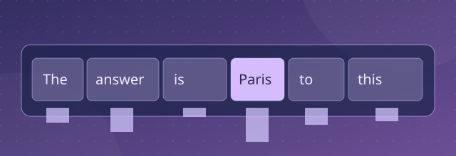

[← All research and insights](../blogs.md){ .xwhy-blog-back }

# Explaining LLM responses

*LLM explainability · XWhy explainer*

Imagine asking a language model to summarise a report. If its answer changes when a single condition is removed from the prompt, that condition deserves attention. But which prompt terms mattered most to the response, and how reliably can we estimate their influence?

## Perturb the prompt carefully

XWhy's `LLMExplainer` changes selected parts of a prompt and measures how those changed prompts relate to a reference response. It fits a local model to produce estimated token contributions to its response-alignment score. This is a practical way to explore sensitivity around the chosen prompt.

For instance, an explanation might show that a condition such as “include only 2025 figures” is influential. A useful follow-up is to remove or rephrase that condition and compare the observed behaviour. The contribution alone does not tell us what computation happened inside the model.

## Match the claim to the measurement

The current documented workflow queries the provider for the original response and uses a semantic-distance measure in the local comparison. Its token contributions therefore describe the *configured response-alignment approximation* for the original prompt, rather than a complete causal account of how the model generated every output token. A prompt heatmap is not a view into private chain-of-thought.

Language model outputs can vary across runs and providers. Report the provider, model version, prompt, embedding and distance settings, perturbation choices and local fit. If a finding is used in an assessment, check whether it survives a few sensible paraphrases and whether the model's observed answer changes in the expected way.

The [LLM explainer guide](../../../explainers/llm/index.md) and [worked LLM example](../../../llm_explainer.md) describe the available interface and interpretation boundary. The related [gSMILE research preprint](https://arxiv.org/abs/2505.21657) provides additional background.
