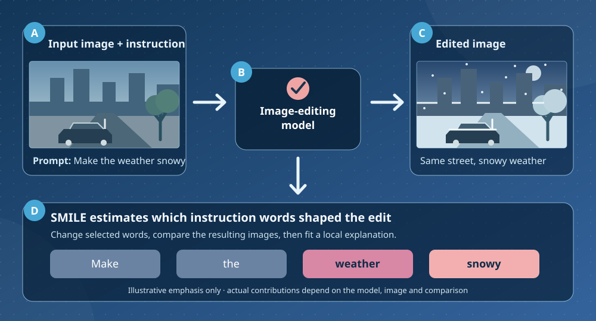

[← All research and insights](../blogs.md){ .xwhy-blog-back }

# Mapping the mind of image editing with SMILE

*Explainable AI · Research note based on a [2025 Hull research group article](https://www.responsibleaihull.com/post/mapping-the-mind-of-an-instruction-based-image-editing-using-smile) by Koorosh Aslansefat.*

An image-editing model can follow an instruction such as “replace the cloudy sky with a clear blue sky,” but a convincing result does not tell us how strongly each part of the instruction shaped the edit. That question matters when a visual change could hide something important, particularly in applications involving medical or safety-related images.

The diagram below traces one example: a street image and a request for snowy weather go into an image editor, which produces a winter version. SMILE then tests changes to the instruction and estimates how much individual words matter to this particular edit.

*Schematic example. Word emphasis illustrates a possible explanation, not measured results.*

## Change the instruction and watch the output

The image-editing SMILE approach makes controlled changes to the text instruction. It removes or changes selected words, runs the editor again, and compares each result with the reference edit. A local model then estimates which parts of the instruction are associated with the largest changes. The explanation can be shown as contributions for individual terms rather than a single score for the whole prompt.

For example, removing “blue” might change the colour of the generated sky while removing “replace” might change whether an edit happens at all. Those are illustrative possibilities, not measured results from a particular model. The actual conclusion depends on the model, input image, perturbations and way the outputs are compared.

## Why the checks matter

A plausible heatmap is only a starting point. Repeat the edit under controlled settings, assess whether the local model fits the observed outputs, and check whether small rewordings produce similar explanations. The explanation concerns the *editing instruction* and the measured image changes; it does not reveal the editor's private reasoning or automatically identify causal source-image pixels.

Read the [XWhy image-editing guide](../../../explainers/image-generation/image-editing.md) for the currently supported workflow and the [research preprint](https://arxiv.org/abs/2412.16277) for the underlying study.

**Original article:** [Mapping the Mind of an Instruction-Based Image Editing Using SMILE](https://www.responsibleaihull.com/post/mapping-the-mind-of-an-instruction-based-image-editing-using-smile). This page is an original XWhy summary and does not reproduce the source article.
